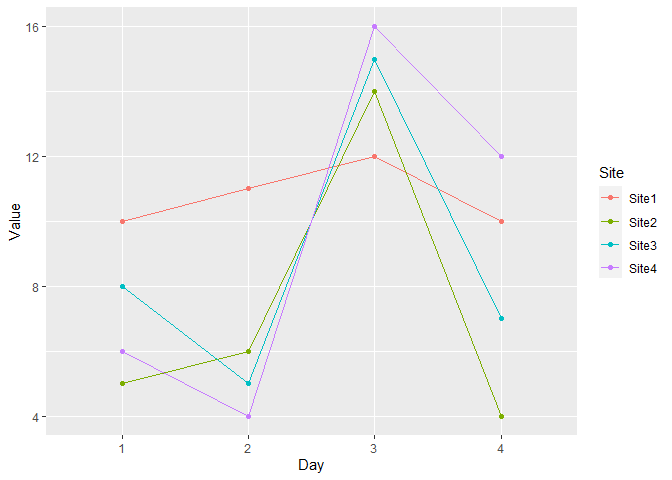

R: tidyverse
================

# Learning resources

Note that in R, there are usually multiple ways to tackle the same
problem. Subsetting, filtering, renaming, etc., can also be achieved via
base R.

-   [R for data science (Wickham&Grolemund,
    2017)](https://r4ds.had.co.nz/): a good guide to the tidyverse.
    Equally importantly, it can teach you about the phylosphy of tidy
    data, and the general “know-how” of data processing and analysis.
    The book has plenty of exercises for you to build “coding muscle”.
    You can find unofficial solutions tot he exercises
    [here](https://jrnold.github.io/r4ds-exercise-solutions/).
-   Cheatsheets covering tidyverse topics, which you can find
    [online](https://www.rstudio.com/resources/cheatsheets/), or in
    RStudio itself (Help \> Cheatsheets).
-   [Crawley
    (2013)](https://www.cs.upc.edu/~robert/teaching/estadistica/TheRBook.pdf):
    complete reference for basci coding, mathematics, statistics, etc.

# Load libraries

We get messages related to conflicts and masking, since there are
functions names that are repeated across packages. Writing the package
that contains our function of interest, like this:
`package::function()`, can make you more mindful about the specific
package and functions involved. Alternatively, you can load the
`conflicted` library, which will throw an error message if you use a
function with a name that is repated across packages.

``` r
library(microbenchmark) # compare time of different functions
library(multcomp) # to get a compact letter display (cld) when microbenchmarking
```

    ## Loading required package: mvtnorm

    ## Loading required package: survival

    ## Loading required package: TH.data

    ## Loading required package: MASS

    ## 
    ## Attaching package: 'TH.data'

    ## The following object is masked from 'package:MASS':
    ## 
    ##     geyser

``` r
library(tidyverse)
```

    ## ── Attaching packages ─────────────────────────────────────── tidyverse 1.3.1 ──

    ## ✔ ggplot2 3.4.0     ✔ purrr   0.3.4
    ## ✔ tibble  3.1.7     ✔ dplyr   1.0.9
    ## ✔ tidyr   1.2.0     ✔ stringr 1.4.0
    ## ✔ readr   2.1.2     ✔ forcats 0.5.1

    ## Warning: package 'ggplot2' was built under R version 4.2.2

    ## ── Conflicts ────────────────────────────────────────── tidyverse_conflicts() ──
    ## ✖ dplyr::filter() masks stats::filter()
    ## ✖ dplyr::lag()    masks stats::lag()
    ## ✖ dplyr::select() masks MASS::select()

# Workflow of the script

## Dataset: a modified starwars

I will demonstrate most of the tidyverse functions using a simplified
version of the `starwars` dataset, containing characteristics of 87
characters from the Star Wars franchise. Type `?starwars` if you want to
learn more about this tibble.

``` r
starwars
```

    ## # A tibble: 87 × 14
    ##    name     height  mass hair_color skin_color eye_color birth_year sex   gender
    ##    <chr>     <int> <dbl> <chr>      <chr>      <chr>          <dbl> <chr> <chr> 
    ##  1 Luke Sk…    172    77 blond      fair       blue            19   male  mascu…
    ##  2 C-3PO       167    75 <NA>       gold       yellow         112   none  mascu…
    ##  3 R2-D2        96    32 <NA>       white, bl… red             33   none  mascu…
    ##  4 Darth V…    202   136 none       white      yellow          41.9 male  mascu…
    ##  5 Leia Or…    150    49 brown      light      brown           19   fema… femin…
    ##  6 Owen La…    178   120 brown, gr… light      blue            52   male  mascu…
    ##  7 Beru Wh…    165    75 brown      light      blue            47   fema… femin…
    ##  8 R5-D4        97    32 <NA>       white, red red             NA   none  mascu…
    ##  9 Biggs D…    183    84 black      light      brown           24   male  mascu…
    ## 10 Obi-Wan…    182    77 auburn, w… fair       blue-gray       57   male  mascu…
    ## # … with 77 more rows, and 5 more variables: homeworld <chr>, species <chr>,
    ## #   films <list>, vehicles <list>, starships <list>

Let’s simplify the dataset, removing the columns that contain lists (it
reduces the length of `summary()` or `str()` calls), changing the type
into a data frame, and keeping only the 10 first observations

``` r
starwars2 <- 
  starwars %>% 
  # where() is a selection helper to select columns based on functions that return TRUE or FALSE
  # in this case, a function that returns TRUE or FALSE depending on whether the column contains lists
  dplyr::select(!where(is.list)) %>% 
  data.frame() %>% 
  # no need to keep all the columns
  dplyr::slice(1:10)
```

We can explore the data frame with the `summary()` and `str()` function.

``` r
summary(starwars2)
```

    ##      name               height           mass         hair_color       
    ##  Length:10          Min.   : 96.0   Min.   : 32.00   Length:10         
    ##  Class :character   1st Qu.:153.8   1st Qu.: 55.50   Class :character  
    ##  Mode  :character   Median :169.5   Median : 76.00   Mode  :character  
    ##                     Mean   :159.2   Mean   : 75.70                     
    ##                     3rd Qu.:181.0   3rd Qu.: 82.25                     
    ##                     Max.   :202.0   Max.   :136.00                     
    ##                                                                        
    ##   skin_color         eye_color           birth_year         sex           
    ##  Length:10          Length:10          Min.   : 19.00   Length:10         
    ##  Class :character   Class :character   1st Qu.: 24.00   Class :character  
    ##  Mode  :character   Mode  :character   Median : 41.90   Mode  :character  
    ##                                        Mean   : 44.99                     
    ##                                        3rd Qu.: 52.00                     
    ##                                        Max.   :112.00                     
    ##                                        NA's   :1                          
    ##     gender           homeworld           species         
    ##  Length:10          Length:10          Length:10         
    ##  Class :character   Class :character   Class :character  
    ##  Mode  :character   Mode  :character   Mode  :character  
    ##                                                          
    ##                                                          
    ##                                                          
    ## 

``` r
str(starwars2)
```

    ## 'data.frame':    10 obs. of  11 variables:
    ##  $ name      : chr  "Luke Skywalker" "C-3PO" "R2-D2" "Darth Vader" ...
    ##  $ height    : int  172 167 96 202 150 178 165 97 183 182
    ##  $ mass      : num  77 75 32 136 49 120 75 32 84 77
    ##  $ hair_color: chr  "blond" NA NA "none" ...
    ##  $ skin_color: chr  "fair" "gold" "white, blue" "white" ...
    ##  $ eye_color : chr  "blue" "yellow" "red" "yellow" ...
    ##  $ birth_year: num  19 112 33 41.9 19 52 47 NA 24 57
    ##  $ sex       : chr  "male" "none" "none" "male" ...
    ##  $ gender    : chr  "masculine" "masculine" "masculine" "masculine" ...
    ##  $ homeworld : chr  "Tatooine" "Tatooine" "Naboo" "Tatooine" ...
    ##  $ species   : chr  "Human" "Droid" "Droid" "Human" ...

We can explore specific properties of the data, such as the presence of
missing values. Although the `summary()` function counts the number of
NA’s, it appears that it only does so for numerical columns.  
We can use the `apply(X, MARGIN, FUN)` function, which applies a
function (`FUN`) over the rows (`MARGIN = 1`) or columns (`MARGIN = 2`)
of a matrix or data frame (`X`). In this case, we can apply a
user-written function that counts the number of missing values per
column.

``` r
# it contains multiple na
apply(starwars2, MARGIN = 2, FUN = function(x) sum(is.na(x)))
```

    ##       name     height       mass hair_color skin_color  eye_color birth_year 
    ##          0          0          0          3          0          0          1 
    ##        sex     gender  homeworld    species 
    ##          0          0          0          0

## The pipe `%>%`

I will demonstrate functions using pipes: `%>%`. The pipe `%>%` passes
the object on the left to the first argument of the function on the
right. The dot `.` can be used to specify the argument to which the
object is passed.

Throughout the script, I will demonstrate the effect of the different
functions by using the `structure()` function, or `str()` for short.
Instead of writing: `str(starwars2)`, I will use the pipe:

``` r
starwars2 %>% 
  str()
```

    ## 'data.frame':    10 obs. of  11 variables:
    ##  $ name      : chr  "Luke Skywalker" "C-3PO" "R2-D2" "Darth Vader" ...
    ##  $ height    : int  172 167 96 202 150 178 165 97 183 182
    ##  $ mass      : num  77 75 32 136 49 120 75 32 84 77
    ##  $ hair_color: chr  "blond" NA NA "none" ...
    ##  $ skin_color: chr  "fair" "gold" "white, blue" "white" ...
    ##  $ eye_color : chr  "blue" "yellow" "red" "yellow" ...
    ##  $ birth_year: num  19 112 33 41.9 19 52 47 NA 24 57
    ##  $ sex       : chr  "male" "none" "none" "male" ...
    ##  $ gender    : chr  "masculine" "masculine" "masculine" "masculine" ...
    ##  $ homeworld : chr  "Tatooine" "Tatooine" "Naboo" "Tatooine" ...
    ##  $ species   : chr  "Human" "Droid" "Droid" "Human" ...

Also note, the following functions will be demonstrated with a data
frame, and there are additional formats for tabular data, such as tibble
and data.table.

# Filtering rows (`filter()`)

The `filter()` takes a data frame, and returns a data frame with the
rows filtered by a set of logical conditions on a set of columns.

``` r
# keep only characters whose homeworld is Tatooine
starwars2 %>% 
  filter(homeworld == "Tatooine")
```

    ##                 name height mass  hair_color skin_color eye_color birth_year
    ## 1     Luke Skywalker    172   77       blond       fair      blue       19.0
    ## 2              C-3PO    167   75        <NA>       gold    yellow      112.0
    ## 3        Darth Vader    202  136        none      white    yellow       41.9
    ## 4          Owen Lars    178  120 brown, grey      light      blue       52.0
    ## 5 Beru Whitesun lars    165   75       brown      light      blue       47.0
    ## 6              R5-D4     97   32        <NA> white, red       red         NA
    ## 7  Biggs Darklighter    183   84       black      light     brown       24.0
    ##      sex    gender homeworld species
    ## 1   male masculine  Tatooine   Human
    ## 2   none masculine  Tatooine   Droid
    ## 3   male masculine  Tatooine   Human
    ## 4   male masculine  Tatooine   Human
    ## 5 female  feminine  Tatooine   Human
    ## 6   none masculine  Tatooine   Droid
    ## 7   male masculine  Tatooine   Human

``` r
# Keep only characters from Tatooine and that are above a certain height
starwars2 %>% 
  filter(homeworld == "Tatooine" & height > 170)
```

    ##                name height mass  hair_color skin_color eye_color birth_year
    ## 1    Luke Skywalker    172   77       blond       fair      blue       19.0
    ## 2       Darth Vader    202  136        none      white    yellow       41.9
    ## 3         Owen Lars    178  120 brown, grey      light      blue       52.0
    ## 4 Biggs Darklighter    183   84       black      light     brown       24.0
    ##    sex    gender homeworld species
    ## 1 male masculine  Tatooine   Human
    ## 2 male masculine  Tatooine   Human
    ## 3 male masculine  Tatooine   Human
    ## 4 male masculine  Tatooine   Human

When filtering, be mindful of missing values. See below different
filtering approaches that take missing values into account.

``` r
nrow(starwars2)
```

    ## [1] 10

``` r
apply(starwars2, MARGIN = 2, FUN = function(x) sum(is.na(x)))
```

    ##       name     height       mass hair_color skin_color  eye_color birth_year 
    ##          0          0          0          3          0          0          1 
    ##        sex     gender  homeworld    species 
    ##          0          0          0          0

``` r
# the table() function accepts an argument to specify whether you want data on NA
table(starwars2$hair_color, useNA = "always")
```

    ## 
    ## auburn, white         black         blond         brown   brown, grey 
    ##             1             1             1             2             1 
    ##          none          <NA> 
    ##             1             3

``` r
# we get only 6 rows because the NA have been filtered out
starwars2 %>% 
  filter(hair_color != "none")
```

    ##                 name height mass    hair_color skin_color eye_color birth_year
    ## 1     Luke Skywalker    172   77         blond       fair      blue         19
    ## 2        Leia Organa    150   49         brown      light     brown         19
    ## 3          Owen Lars    178  120   brown, grey      light      blue         52
    ## 4 Beru Whitesun lars    165   75         brown      light      blue         47
    ## 5  Biggs Darklighter    183   84         black      light     brown         24
    ## 6     Obi-Wan Kenobi    182   77 auburn, white       fair blue-gray         57
    ##      sex    gender homeworld species
    ## 1   male masculine  Tatooine   Human
    ## 2 female  feminine  Alderaan   Human
    ## 3   male masculine  Tatooine   Human
    ## 4 female  feminine  Tatooine   Human
    ## 5   male masculine  Tatooine   Human
    ## 6   male masculine   Stewjon   Human

``` r
# this code yields the same result
starwars2 %>% 
  filter(hair_color != "none" & !is.na(hair_color))
```

    ##                 name height mass    hair_color skin_color eye_color birth_year
    ## 1     Luke Skywalker    172   77         blond       fair      blue         19
    ## 2        Leia Organa    150   49         brown      light     brown         19
    ## 3          Owen Lars    178  120   brown, grey      light      blue         52
    ## 4 Beru Whitesun lars    165   75         brown      light      blue         47
    ## 5  Biggs Darklighter    183   84         black      light     brown         24
    ## 6     Obi-Wan Kenobi    182   77 auburn, white       fair blue-gray         57
    ##      sex    gender homeworld species
    ## 1   male masculine  Tatooine   Human
    ## 2 female  feminine  Alderaan   Human
    ## 3   male masculine  Tatooine   Human
    ## 4 female  feminine  Tatooine   Human
    ## 5   male masculine  Tatooine   Human
    ## 6   male masculine   Stewjon   Human

``` r
# use the OR logical operator (|) to keep characters that don't have hair or no data on hair
starwars2 %>% 
  filter(hair_color != "none" | is.na(hair_color))
```

    ##                 name height mass    hair_color  skin_color eye_color birth_year
    ## 1     Luke Skywalker    172   77         blond        fair      blue         19
    ## 2              C-3PO    167   75          <NA>        gold    yellow        112
    ## 3              R2-D2     96   32          <NA> white, blue       red         33
    ## 4        Leia Organa    150   49         brown       light     brown         19
    ## 5          Owen Lars    178  120   brown, grey       light      blue         52
    ## 6 Beru Whitesun lars    165   75         brown       light      blue         47
    ## 7              R5-D4     97   32          <NA>  white, red       red         NA
    ## 8  Biggs Darklighter    183   84         black       light     brown         24
    ## 9     Obi-Wan Kenobi    182   77 auburn, white        fair blue-gray         57
    ##      sex    gender homeworld species
    ## 1   male masculine  Tatooine   Human
    ## 2   none masculine  Tatooine   Droid
    ## 3   none masculine     Naboo   Droid
    ## 4 female  feminine  Alderaan   Human
    ## 5   male masculine  Tatooine   Human
    ## 6 female  feminine  Tatooine   Human
    ## 7   none masculine  Tatooine   Droid
    ## 8   male masculine  Tatooine   Human
    ## 9   male masculine   Stewjon   Human

# Summarising by groups (`group_by()` + `summarise`)

The `summarise()` function takes a data frame, and returns a data frame
with fewer rows. If there is no grouping variable (declared through
`group_by()`), it will return a data frame with a single row summarizing
all observations. `summarize()`is a synonym of `summarise`.

``` r
mean(starwars2$height, na.rm = T)
```

    ## [1] 159.2

``` r
# we get the same value as in the previous base code approach, but in data frame format
starwars2 %>% 
  summarise(mean.height = mean(height, na.rm = T))
```

    ##   mean.height
    ## 1       159.2

The `group_by()` function changes the type of the data that enters into
`summarise()`, as well as the behavior of `summarise()`.

``` r
str(starwars2)
```

    ## 'data.frame':    10 obs. of  11 variables:
    ##  $ name      : chr  "Luke Skywalker" "C-3PO" "R2-D2" "Darth Vader" ...
    ##  $ height    : int  172 167 96 202 150 178 165 97 183 182
    ##  $ mass      : num  77 75 32 136 49 120 75 32 84 77
    ##  $ hair_color: chr  "blond" NA NA "none" ...
    ##  $ skin_color: chr  "fair" "gold" "white, blue" "white" ...
    ##  $ eye_color : chr  "blue" "yellow" "red" "yellow" ...
    ##  $ birth_year: num  19 112 33 41.9 19 52 47 NA 24 57
    ##  $ sex       : chr  "male" "none" "none" "male" ...
    ##  $ gender    : chr  "masculine" "masculine" "masculine" "masculine" ...
    ##  $ homeworld : chr  "Tatooine" "Tatooine" "Naboo" "Tatooine" ...
    ##  $ species   : chr  "Human" "Droid" "Droid" "Human" ...

``` r
# Note that the type of object has changed
starwars2 %>% 
  group_by(homeworld) %>% 
  str()
```

    ## gropd_df [10 × 11] (S3: grouped_df/tbl_df/tbl/data.frame)
    ##  $ name      : chr [1:10] "Luke Skywalker" "C-3PO" "R2-D2" "Darth Vader" ...
    ##  $ height    : int [1:10] 172 167 96 202 150 178 165 97 183 182
    ##  $ mass      : num [1:10] 77 75 32 136 49 120 75 32 84 77
    ##  $ hair_color: chr [1:10] "blond" NA NA "none" ...
    ##  $ skin_color: chr [1:10] "fair" "gold" "white, blue" "white" ...
    ##  $ eye_color : chr [1:10] "blue" "yellow" "red" "yellow" ...
    ##  $ birth_year: num [1:10] 19 112 33 41.9 19 52 47 NA 24 57
    ##  $ sex       : chr [1:10] "male" "none" "none" "male" ...
    ##  $ gender    : chr [1:10] "masculine" "masculine" "masculine" "masculine" ...
    ##  $ homeworld : chr [1:10] "Tatooine" "Tatooine" "Naboo" "Tatooine" ...
    ##  $ species   : chr [1:10] "Human" "Droid" "Droid" "Human" ...
    ##  - attr(*, "groups")= tibble [4 × 2] (S3: tbl_df/tbl/data.frame)
    ##   ..$ homeworld: chr [1:4] "Alderaan" "Naboo" "Stewjon" "Tatooine"
    ##   ..$ .rows    : list<int> [1:4] 
    ##   .. ..$ : int 5
    ##   .. ..$ : int 3
    ##   .. ..$ : int 10
    ##   .. ..$ : int [1:7] 1 2 4 6 7 8 9
    ##   .. ..@ ptype: int(0) 
    ##   ..- attr(*, ".drop")= logi TRUE

The `group_by()` function changes the behavior of `summarise()`: instead
of providing a single summary value, it provides a summary value per
category of the grouping variable.

When using such functions, it is a good idea to think ahead: how many
rows should we expect? You can use `n_distinct()` to check how many
different groups are there, but beware of missing values.

``` r
n_distinct(starwars$homeworld)
```

    ## [1] 49

``` r
n_distinct(starwars$homeworld, na.rm = TRUE)
```

    ## [1] 48

``` r
starwars2 %>% 
  group_by(homeworld) %>% 
  summarise(mean.height = mean(height, na.rm = TRUE))
```

    ## # A tibble: 4 × 2
    ##   homeworld mean.height
    ##   <chr>           <dbl>
    ## 1 Alderaan         150 
    ## 2 Naboo             96 
    ## 3 Stewjon          182 
    ## 4 Tatooine         166.

The summarized dataset can be piped to `ggplot()` for visualization.
Remember to use the plus symbol (`+`) rather than the pipe (`%>%`)
inside the `ggplot()` call. A couple of functions to visualize the
datasets are: `arrange()` (orders the rows of a data frame by the values
of selected columns), and `desc()` (sorts in descending order: from
greatest to lowest).

``` r
# Calculate the number of characters per planet, and sort the data frame in descending order
(star.char <-
  starwars2 %>% 
  filter(!is.na(homeworld)) %>% 
  group_by(homeworld) %>% 
  summarise(n.characters = n_distinct(name))) %>% 
  arrange(desc(n.characters))
```

    ## # A tibble: 4 × 2
    ##   homeworld n.characters
    ##   <chr>            <int>
    ## 1 Tatooine             7
    ## 2 Alderaan             1
    ## 3 Naboo                1
    ## 4 Stewjon              1

# Filtering a grouped dataset

You might be interested in using the results of a summary to filter the
original data. For instance, keep only data from the planets that have 2
characters.

``` r
starwars2 %>% 
  filter(!is.na(homeworld)) %>% 
  group_by(homeworld) %>% 
  filter(n_distinct(name) == 2)
```

    ## # A tibble: 0 × 11
    ## # Groups:   homeworld [0]
    ## # … with 11 variables: name <chr>, height <int>, mass <dbl>, hair_color <chr>,
    ## #   skin_color <chr>, eye_color <chr>, birth_year <dbl>, sex <chr>,
    ## #   gender <chr>, homeworld <chr>, species <chr>

# Conditional expressions (`if_else()` + `case_when()`)

We can combine `mutate()` with `if_else()` or `case_when()` to create a
new column, whose values depend on some logical conditions. `if_else()`
handles a single logical condition (although you can evaluate multiple
conditions by writing `if_else()` statements inside other `if_else()`
statements); while `case_when()` can handle many logical conditions.

## A single logical condition (`if_else()`)

We can combine `if_else()` with `mutate()` to generate a new variable,
with values that depend on the values of other variables.

``` r
# Tatooine is a planet covered in deserts (there are others, but this code is to illustrate the function)
starwars2 %>%
  dplyr::select(homeworld) %>%
  # keep the first 10 rows
  dplyr::slice(1:10) %>%
  dplyr::mutate(biome = if_else(
    condition = homeworld == "Tatooine",
    true = "desert",
    false = "other"
  ))
```

    ##    homeworld  biome
    ## 1   Tatooine desert
    ## 2   Tatooine desert
    ## 3      Naboo  other
    ## 4   Tatooine desert
    ## 5   Alderaan  other
    ## 6   Tatooine desert
    ## 7   Tatooine desert
    ## 8   Tatooine desert
    ## 9   Tatooine desert
    ## 10   Stewjon  other

One could combine multiple `if_else()` statements to evaluate multiple
logical conditions.

``` r
starwars2 %>% 
  dplyr::select(hair_color) %>% 
  dplyr::slice(1:10) %>%
  mutate(hair = if_else(hair_color == "blond", true = "blond", false = if_else(hair_color == "black", true = "black", false = "other")))
```

    ##       hair_color  hair
    ## 1          blond blond
    ## 2           <NA>  <NA>
    ## 3           <NA>  <NA>
    ## 4           none other
    ## 5          brown other
    ## 6    brown, grey other
    ## 7          brown other
    ## 8           <NA>  <NA>
    ## 9          black black
    ## 10 auburn, white other

## Multiple logical conditions (`case_when()`)

Luckily for us, the `case_when()` function allows to vectorise multiple
`if_else()` statements. It consists of two-sided formulas: the left hand
side determines the logical conditions to be evaluated, the right hand
side of the formula determines the replacement values, which have to be
of the same type (all of them character, all of them numeric, etc). If
there is no match, the default is to return `NA`, but you can change it
through `TRUE ~ your_desired_output`

``` r
# we can re-write the previous nested if_else like this
starwars2 %>%
  dplyr::select(hair_color) %>%
  dplyr::slice(1:10) %>%
  mutate(
    hair = case_when(
      hair_color == "blond" ~ "blond",
      hair_color == "black" ~ "black",
      !is.na(hair_color) & !(hair_color %in% c("black", "blond")) ~ "other"
      # the default behaviour in case of no match is to return NA (or NA_character_ to be consistent with the other vectors)
      #TRUE ~ NA_character_
    )
  )
```

    ##       hair_color  hair
    ## 1          blond blond
    ## 2           <NA>  <NA>
    ## 3           <NA>  <NA>
    ## 4           none other
    ## 5          brown other
    ## 6    brown, grey other
    ## 7          brown other
    ## 8           <NA>  <NA>
    ## 9          black black
    ## 10 auburn, white other

``` r
# if there is no match, NA is returned
starwars2 %>% 
  dplyr::select(hair_color) %>% 
  dplyr::slice(1:10) %>%
  mutate(hair = case_when(hair_color == "blond" ~ "blond",
                          hair_color == "black" ~ "black"))
```

    ##       hair_color  hair
    ## 1          blond blond
    ## 2           <NA>  <NA>
    ## 3           <NA>  <NA>
    ## 4           none  <NA>
    ## 5          brown  <NA>
    ## 6    brown, grey  <NA>
    ## 7          brown  <NA>
    ## 8           <NA>  <NA>
    ## 9          black black
    ## 10 auburn, white  <NA>

``` r
# this lumps together no data with different hair color
starwars2 %>% 
  dplyr::select(hair_color) %>% 
  dplyr::slice(1:10) %>%
  mutate(hair = case_when(hair_color == "blond" ~ "blond",
                          hair_color == "black" ~ "black",
                          TRUE ~ "other"))
```

    ##       hair_color  hair
    ## 1          blond blond
    ## 2           <NA> other
    ## 3           <NA> other
    ## 4           none other
    ## 5          brown other
    ## 6    brown, grey other
    ## 7          brown other
    ## 8           <NA> other
    ## 9          black black
    ## 10 auburn, white other

``` r
# this makes a differnece between no data and different hair color
starwars2 %>% 
  dplyr::select(hair_color) %>% 
  dplyr::slice(1:10) %>%
  mutate(hair = case_when(hair_color == "blond" ~ "blond",
                          hair_color == "black" ~ "black",
                          is.na(hair_color) ~ "no data",
                          TRUE ~ "other"))
```

    ##       hair_color    hair
    ## 1          blond   blond
    ## 2           <NA> no data
    ## 3           <NA> no data
    ## 4           none   other
    ## 5          brown   other
    ## 6    brown, grey   other
    ## 7          brown   other
    ## 8           <NA> no data
    ## 9          black   black
    ## 10 auburn, white   other

But what if we want to specify NA as the output in case there is no
data? Mind you that `NA` is a logical, so you need to specify
`NA_character_` if you want strings as the otuput.

``` r
class(NA)
```

    ## [1] "logical"

``` r
class(NA_character_)
```

    ## [1] "character"

``` r
# The right hand side of the formula needs to be of the same type, therefore, this won't work
starwars2 %>% 
  dplyr::select(hair_color) %>% 
  dplyr::slice(1:10) %>%
  mutate(hair = case_when(hair_color == "blond" ~ "blond",
                          hair_color == "black" ~ "black",
                          is.na(hair_color) ~ NA,
                          TRUE ~ "other"))
```

    ## Error in `mutate()`:
    ## ! Problem while computing `hair = case_when(...)`.
    ## Caused by error in `` names(message) <- `*vtmp*` ``:
    ## ! el atributo 'names' [1] debe tener la misma longitud que el vector [0]

``` r
# we can specify NA_character_ so the right hand side of the formula is of consistent type
starwars2 %>% 
  dplyr::select(hair_color) %>% 
  dplyr::slice(1:10) %>%
  mutate(hair = case_when(hair_color == "blond" ~ "blond",
                          hair_color == "black" ~ "black",
                          is.na(hair_color) ~ NA_character_,
                          TRUE ~ "other"))
```

    ##       hair_color  hair
    ## 1          blond blond
    ## 2           <NA>  <NA>
    ## 3           <NA>  <NA>
    ## 4           none other
    ## 5          brown other
    ## 6    brown, grey other
    ## 7          brown other
    ## 8           <NA>  <NA>
    ## 9          black black
    ## 10 auburn, white other

# Computing one row at a time (`rowwise()`)

The `rowwise()` function allows to compute on a data frame one row at a
time. Similarly to `group_by()`, it changes how verbs operate on the
data frame, and it also changes the type of the object. See some
examples below for a made-up data frame containing data on temperature
and precipitation recorded on 2-4 different days, across 4 sites.

``` r
(data.row <-
  data.frame(Site = c("Site1", "Site2", "Site3", "Site4"),
             Temp1 = c(10, 5, 8, 6),
             Temp2 = c(11, 6, 5, 4),
             Temp3 = c(12, 14, 15, 16),
             Temp4 = c(10, 4, 7, 12),
             Prec1 = c(3, 4, 5, 6),
             Prec2 = c(4, 2, 2, 8)))
```

    ##    Site Temp1 Temp2 Temp3 Temp4 Prec1 Prec2
    ## 1 Site1    10    11    12    10     3     4
    ## 2 Site2     5     6    14     4     4     2
    ## 3 Site3     8     5    15     7     5     2
    ## 4 Site4     6     4    16    12     6     8

``` r
str(data.row)
```

    ## 'data.frame':    4 obs. of  7 variables:
    ##  $ Site : chr  "Site1" "Site2" "Site3" "Site4"
    ##  $ Temp1: num  10 5 8 6
    ##  $ Temp2: num  11 6 5 4
    ##  $ Temp3: num  12 14 15 16
    ##  $ Temp4: num  10 4 7 12
    ##  $ Prec1: num  3 4 5 6
    ##  $ Prec2: num  4 2 2 8

``` r
# the object type has changed
data.row %>%
  rowwise() %>% 
  str()
```

    ## rowws_df [4 × 7] (S3: rowwise_df/tbl_df/tbl/data.frame)
    ##  $ Site : chr [1:4] "Site1" "Site2" "Site3" "Site4"
    ##  $ Temp1: num [1:4] 10 5 8 6
    ##  $ Temp2: num [1:4] 11 6 5 4
    ##  $ Temp3: num [1:4] 12 14 15 16
    ##  $ Temp4: num [1:4] 10 4 7 12
    ##  $ Prec1: num [1:4] 3 4 5 6
    ##  $ Prec2: num [1:4] 4 2 2 8
    ##  - attr(*, "groups")= tibble [4 × 1] (S3: tbl_df/tbl/data.frame)
    ##   ..$ .rows: list<int> [1:4] 
    ##   .. ..$ : int 1
    ##   .. ..$ : int 2
    ##   .. ..$ : int 3
    ##   .. ..$ : int 4
    ##   .. ..@ ptype: int(0)

The grouping can be undone with `ungroup` (you might need an additional
function to remove the tibble class in case you don’t want it).

``` r
data.row %>%
  rowwise() %>% 
  ungroup() %>% 
  str()
```

    ## tibble [4 × 7] (S3: tbl_df/tbl/data.frame)
    ##  $ Site : chr [1:4] "Site1" "Site2" "Site3" "Site4"
    ##  $ Temp1: num [1:4] 10 5 8 6
    ##  $ Temp2: num [1:4] 11 6 5 4
    ##  $ Temp3: num [1:4] 12 14 15 16
    ##  $ Temp4: num [1:4] 10 4 7 12
    ##  $ Prec1: num [1:4] 3 4 5 6
    ##  $ Prec2: num [1:4] 4 2 2 8

To specify which columns should be used, you may use `c()` or
`c_across()` inside the function you are calling. `c_across` can be
combined with tidy selection, which is always helpful.

``` r
# Calculate the minimum value per row, mind to remove the Site column which is a factor
data.row %>% 
  rowwise() %>%
  mutate(min = min(c_across(-starts_with("Site"))))
```

    ## # A tibble: 4 × 8
    ## # Rowwise: 
    ##   Site  Temp1 Temp2 Temp3 Temp4 Prec1 Prec2   min
    ##   <chr> <dbl> <dbl> <dbl> <dbl> <dbl> <dbl> <dbl>
    ## 1 Site1    10    11    12    10     3     4     3
    ## 2 Site2     5     6    14     4     4     2     2
    ## 3 Site3     8     5    15     7     5     2     2
    ## 4 Site4     6     4    16    12     6     8     4

``` r
# you may specify the variables of interest individually
data.row %>% 
  rowwise() %>%
  mutate(min = min(c(Temp1, Temp2, Temp3)))
```

    ## # A tibble: 4 × 8
    ## # Rowwise: 
    ##   Site  Temp1 Temp2 Temp3 Temp4 Prec1 Prec2   min
    ##   <chr> <dbl> <dbl> <dbl> <dbl> <dbl> <dbl> <dbl>
    ## 1 Site1    10    11    12    10     3     4    10
    ## 2 Site2     5     6    14     4     4     2     5
    ## 3 Site3     8     5    15     7     5     2     5
    ## 4 Site4     6     4    16    12     6     8     4

``` r
# Calculate the minimum value per row, but only for temperature
data.row %>% 
  rowwise() %>%
  mutate(min = min(c_across(starts_with("Temp"))))
```

    ## # A tibble: 4 × 8
    ## # Rowwise: 
    ##   Site  Temp1 Temp2 Temp3 Temp4 Prec1 Prec2   min
    ##   <chr> <dbl> <dbl> <dbl> <dbl> <dbl> <dbl> <dbl>
    ## 1 Site1    10    11    12    10     3     4    10
    ## 2 Site2     5     6    14     4     4     2     4
    ## 3 Site3     8     5    15     7     5     2     5
    ## 4 Site4     6     4    16    12     6     8     4

``` r
# You may also obtain a reduced data frame by calling summarise()
data.row %>%
  rowwise() %>%
  summarise(min.temp = min(c_across(starts_with("Temp"))),
            min.prec = min(c(Prec1, Prec2)))
```

    ## # A tibble: 4 × 2
    ##   min.temp min.prec
    ##      <dbl>    <dbl>
    ## 1       10        3
    ## 2        4        2
    ## 3        5        2
    ## 4        4        6

``` r
# Alternatively, you can keep only an identifier column, so it is preserved when you call summarise()
data.row %>%
  rowwise(Site) %>%
  summarise(min.temp = min(c_across(starts_with("Temp"))),
            min.prec = min(c(Prec1, Prec2)))
```

    ## `summarise()` has grouped output by 'Site'. You can override using the
    ## `.groups` argument.

    ## # A tibble: 4 × 3
    ## # Groups:   Site [4]
    ##   Site  min.temp min.prec
    ##   <chr>    <dbl>    <dbl>
    ## 1 Site1       10        3
    ## 2 Site2        4        2
    ## 3 Site3        5        2
    ## 4 Site4        4        6

This is reminiscent of the `apply()` function, which can be applied on
rows (`1`) and/or columns (`2`), through the `MARGIN` argument.

``` r
# remove the first column, as it is a factor
apply(data.row[, -1], MARGIN = 1, min)
```

    ## [1] 3 2 2 4

``` r
apply(data.row[, -1], MARGIN = 2, min)
```

    ## Temp1 Temp2 Temp3 Temp4 Prec1 Prec2 
    ##     5     4    12     4     3     2

# Tidying a messy dataset

In the preceding examples we have performed summaries of temperature of
precipitation on a row-by-row manner (`rowwise`). This is because we
have the same variable spread across multiple columns. Temperature is
spread across 3 columns, precipitation across 2 columns. Moreover, the
day in which the measure was taken is also spread, in a somewhat cryptic
way.

But what if we could re-arrange the data so that the calculation of
summaries would be more straightforward? Moreover, imagine you are
interested in a graph of how temperature had fluctuated across sites
during those 4 days. This is difficult given the current structure of
the data. What would help us is a way to re-arrange the data, such that
information of a same kind (day of measurement and type of environmental
variable) are in a single column.

## Re-arranging the data (`pivot_longer()`)

Introducing `pivot longer`, a function that increases the number of rows
and decreases the number of columns. You need to specify `cols`: columns
that contain data to be pivotted to longer format (tidy selection
available), `names_to`: the name of the new column that will store the
column names of the selected columns, `values_to`: name of the column
that will store the values of the pivotted columns. In case you are
wondering, yes, there is a function that does the opposite:
`pivot_wider()`.  
You can see nice animations of the pivoting process
[here](https://fromthebottomoftheheap.net/2019/10/25/pivoting-tidily/).

``` r
(data.long <-
  data.row %>%
  pivot_longer(cols = starts_with(c("Temp", "Prec")),
               values_to = "Value",
               names_to = "temporary"))
```

    ## # A tibble: 24 × 3
    ##    Site  temporary Value
    ##    <chr> <chr>     <dbl>
    ##  1 Site1 Temp1        10
    ##  2 Site1 Temp2        11
    ##  3 Site1 Temp3        12
    ##  4 Site1 Temp4        10
    ##  5 Site1 Prec1         3
    ##  6 Site1 Prec2         4
    ##  7 Site2 Temp1         5
    ##  8 Site2 Temp2         6
    ##  9 Site2 Temp3        14
    ## 10 Site2 Temp4         4
    ## # … with 14 more rows

## Splitting variables across multiple columns (`separate()`)

We still have a problem: the day in which the measure was taken is not
separated from the environmental variable. We can use `separate()`,
which splits one column into multiple columns, by splitting wherever a
separator character appears, or by position (through positive or
negative numerical values). This function takes the name of the column
to separate, and the names of the columns to separate into.

``` r
(data.long2 <-
  data.long %>%
   # use numerical values: negative values start on the far right of the strings
  separate(col = temporary, into = c("Variable", "Day"), sep = -1))
```

    ## # A tibble: 24 × 4
    ##    Site  Variable Day   Value
    ##    <chr> <chr>    <chr> <dbl>
    ##  1 Site1 Temp     1        10
    ##  2 Site1 Temp     2        11
    ##  3 Site1 Temp     3        12
    ##  4 Site1 Temp     4        10
    ##  5 Site1 Prec     1         3
    ##  6 Site1 Prec     2         4
    ##  7 Site2 Temp     1         5
    ##  8 Site2 Temp     2         6
    ##  9 Site2 Temp     3        14
    ## 10 Site2 Temp     4         4
    ## # … with 14 more rows

## The joys of working with tidy data

In a long format, obtaining summaries per site or day is quite
straightfoward.

``` r
# find lowest temperature across sites
data.long2 %>% 
  filter(Variable == "Temp") %>% 
  group_by(Site) %>% 
  summarise(min = min(Value))
```

    ## # A tibble: 4 × 2
    ##   Site    min
    ##   <chr> <dbl>
    ## 1 Site1    10
    ## 2 Site2     4
    ## 3 Site3     5
    ## 4 Site4     4

``` r
# find lowest temperature across days
data.long2 %>% 
  filter(Variable == "Temp") %>% 
  group_by(Day) %>% 
  summarise(min = min(Value))
```

    ## # A tibble: 4 × 2
    ##   Day     min
    ##   <chr> <dbl>
    ## 1 1         5
    ## 2 2         4
    ## 3 3        12
    ## 4 4         4

The long format is also better for plotting. The following graph,
showing how temperature had fluctuated across sites during those 4 days,
would be difficult to draw based on the original data.

``` r
ggplot(data = filter(data.long2, Variable == "Temp"), aes(x = Day, y = Value, group = Site, col = Site)) +
  geom_point() +
  geom_line()
```

<!-- -->

# Filling empty rows with information from other rows (`fill()`)

A database might contain empty rows that represent that the previous
entry hasn’t changed. For instance, the following made-up data frame
records the abundance of some trees across locations, and the blank
space indicates that the species hasn’t changed. The `tidyr::fill()`
function takes a data.frame, a selection of columns to fill (you may use
tidy selection). The `.direction` argument specifies how the missing, in
this case we should specify `down`, but there are other options.

``` r
# Wrapping the code in parentheses prints the created object
(data.fill <-
  data.frame(species = c("Ailanthus altissima", NA, NA, "Robinia pseudoacacia", NA, "Sambucus nigra", NA),
             site = c("Site1", "Site2", "Site3", "Site1", "Site4", "Site2", "Site3"),
             abundance = c(1:7)))
```

    ##                species  site abundance
    ## 1  Ailanthus altissima Site1         1
    ## 2                 <NA> Site2         2
    ## 3                 <NA> Site3         3
    ## 4 Robinia pseudoacacia Site1         4
    ## 5                 <NA> Site4         5
    ## 6       Sambucus nigra Site2         6
    ## 7                 <NA> Site3         7

``` r
# fill the missing values downwards (the last non-missing values is carried down)
data.fill %>%
  tidyr::fill(species, .direction = "down")
```

    ##                species  site abundance
    ## 1  Ailanthus altissima Site1         1
    ## 2  Ailanthus altissima Site2         2
    ## 3  Ailanthus altissima Site3         3
    ## 4 Robinia pseudoacacia Site1         4
    ## 5 Robinia pseudoacacia Site4         5
    ## 6       Sambucus nigra Site2         6
    ## 7       Sambucus nigra Site3         7

# Bonus: compare running time through microbenchmark

Depending on the type of data operations and analyses you are
performing, you might have come across situations in which you are
concerned about how much time it takes to run some code. Maybe you are
dealing with large databases, or have to perform the same operation many
times. Or maybe you’ve read about a packge or function that claims to be
faster than the package or funciton you are currently using.

How to test for yourself whether you can benefit from that alleged
greater speed? You can use the `microbenchmark` package to compare the
time it takes to run a set of expressions. If the package `multcomp`is
available, a statistical ranking based on pairwise differences is
displayed in the `cld` column (compact letter display).

Let’s compare the running time of `if_else` (tidyverse) and `ifelse()`
(base). According to the documentation, the tidyverse function is more
strict, checking that the `true` and `false` are the same type. As a
result, it is faster. Let’s test this claim with some randomly generated
vectors.

``` r
# create vectors of different length to compare the running time between ifelse() and if_else()

# runif: random uniform distribution, which you can use to generate a vector of random numbers of a specified length
short.vector <- runif(n = 100, min = 0, max = 10^6)
long.vector <- runif(n = 10^6, min = 0, max = 10^6)

microbenchmark::microbenchmark(
  
    ifelse(
    test = short.vector >= 1000,
    yes = "greater",
    no = "lower"
  ),
  
  if_else(
    condition = short.vector >= 1000,
    true = "greater",
    false = "lower"
  ),

  ifelse(
    test = long.vector >= 1000,
    yes = "greater",
    no = "lower"
  ),
  
  if_else(
    condition = long.vector >= 1000,
    true = "greater",
    false = "lower"
  ),
  
  # Number of times to evaluate the expression
  times = 20,
  
  # Specify the unit in which the running time will printed. I think the default units are nanoseconds, though I am not sure
  unit = "s"
)
```

    ## Unit: seconds
    ##                                                                          expr
    ##            ifelse(test = short.vector >= 1000, yes = "greater", no = "lower")
    ##  if_else(condition = short.vector >= 1000, true = "greater", false = "lower")
    ##             ifelse(test = long.vector >= 1000, yes = "greater", no = "lower")
    ##   if_else(condition = long.vector >= 1000, true = "greater", false = "lower")
    ##          min           lq         mean       median           uq         max
    ##  0.000025701 0.0000321010 4.316605e-05 0.0000408020 0.0000553005 0.000062100
    ##  0.000025102 0.0000494515 6.209130e-05 0.0000647015 0.0000704015 0.000142401
    ##  0.202750001 0.2064859005 2.205115e-01 0.2090442010 0.2148032505 0.323478501
    ##  0.034671602 0.0410708505 6.129297e-02 0.0452847010 0.0492832005 0.165058601
    ##  neval cld
    ##     20 a  
    ##     20 a  
    ##     20   c
    ##     20  b

To assess the consistency of our results, let’s compare the two
functions again, this time using letters instead of numbers. The
`letters` object contains the 26 lower-case letters of the Roman
alphabet.

``` r
short.letters <- rep(letters, 100)
long.letters <- rep(letters, 10^5)

microbenchmark::microbenchmark(
  
    ifelse(
    test = short.letters == "a",
    yes = "first letter",
    no = "other"
  ),
  
  if_else(
    condition = short.letters == "a",
    true = "first letter",
    false = "other"
  ),

  ifelse(
    test = long.letters == "a",
    yes = "first letter",
    no = "other"
  ),
  
  if_else(
    condition = long.letters == "a",
    true = "first letter",
    false = "other"
  ),
  
  times = 20,
  
  unit = "s"
)
```

    ## Unit: seconds
    ##                                                                                    expr
    ##                 ifelse(test = short.letters == "a", yes = "first letter", no = "other")
    ##  if_else(condition = short.letters == "a", true = "first letter",      false = "other")
    ##                  ifelse(test = long.letters == "a", yes = "first letter", no = "other")
    ##   if_else(condition = long.letters == "a", true = "first letter",      false = "other")
    ##          min           lq         mean       median          uq         max
    ##  0.000511301 0.0005368505 0.0005543260 0.0005479005 0.000574001 0.000606101
    ##  0.000099800 0.0001222010 0.0006600707 0.0001526510 0.000165051 0.010432401
    ##  0.542050801 0.5535287510 0.5831043410 0.5604768010 0.578221551 0.695208601
    ##  0.106805101 0.1091542520 0.1390867409 0.1214569015 0.126815701 0.237438200
    ##  neval cld
    ##     20 a  
    ##     20 a  
    ##     20   c
    ##     20  b

<https://stackoverflow.com/questions/68460102/mutate-inside-a-function-object-not-found>
<https://stackoverflow.com/questions/26003574/use-dynamic-variable-names-in-dplyr>
<https://b-rodrigues.github.io/modern_R/defining-your-own-functions.html#functions-that-take-columns-of-data-as-arguments>
<https://b-rodrigues.github.io/modern_R/defining-your-own-functions.html#functions-that-take-columns-of-data-as-arguments>
